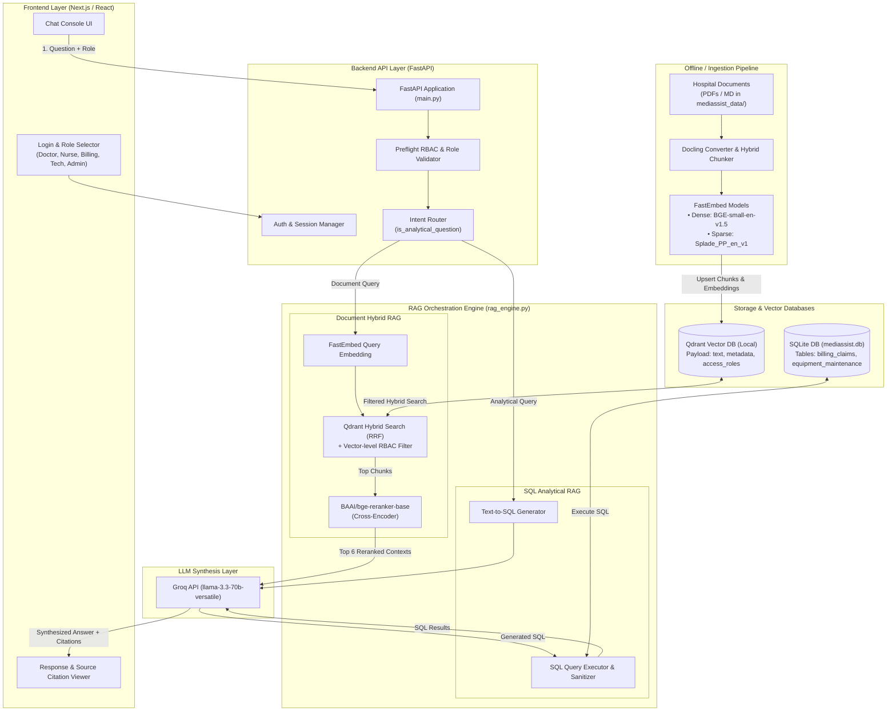

# MediBot — Advanced RAG & Role-Based Access Control

MediBot is a production-grade internal intelligent assistant for **MediAssist Health Network** that parses complex medical PDFs, indexes them into a local Qdrant database, and enforces strict **Role-Based Access Control (RBAC)** at the vector store level. It also integrates a **SQL RAG** chain for answering analytical questions about billing and maintenance.

---

## 🛠️ Tech Stack & Architecture

- **Backend**: FastAPI, Uvicorn, Python 3.12
- **Vector Database**: Qdrant (local file storage mode)
- **Document Parsing**: Docling (structure-aware PDF & Markdown parsing)
- **Embedding Models (Local)**: FastEmbed (`BGE-small-en` for dense embeddings, `Splade` for sparse keyword embeddings)
- **Reranker (Local)**: Sentence Transformers (`BAAI/bge-reranker-base`)
- **LLM Synthesis**: Groq API (`llama-3.3-70b-versatile`)
- **Relational DB**: SQLite (`mediassist.db`)
- **Frontend**: Next.js, React, Tailwind CSS

### System Architecture Diagram



### Query Flow Diagram

```mermaid
flowchart TD
    User["User Interface (Next.js)"]
    API["FastAPI Backend (/chat)"]
    RBAC["RBAC Filter (Retrieval Layer)"]
    Qdrant["Qdrant DB (Dense + Sparse)"]
    Rerank["Cross-Encoder Rerank"]
    SQLite["SQLite DB (mediassist.db)"]
    LLM["Groq LLM (Llama 3.3)"]

    User -->|Chat Request + Role| API
    API -->|Intent Routing| Route{"Is Query Analytical?"}
    
    Route -- "No (Document Query)" --> RBAC
    RBAC -->|Apply access_roles Filter| Qdrant
    Qdrant -->|Prefetch Dense + Sparse (RRF)| Rerank
    Rerank -->|Top 6 Reranked Chunks| LLM
    LLM -->|Synthesize Response| API
    
    Route -- "Yes (Analytical Query)" --> CheckRole{"Is Role Admin/Billing?"}
    CheckRole -- "Yes" --> SQLite
    SQLite -->|Raw Rows| LLM
    CheckRole -- "No" --> Block["Refusal Response"]
    
    API -->|Response + Citations + RAG Type| User
```

---

## 📂 Project Structure

```
Medibot_Assignment_Resources/
├── backend/
│   ├── config.py          # Paths, settings, and RBAC mapping
│   ├── db_helper.py       # SQL queries and schema metadata
│   ├── ingest.py          # Docling parser and Qdrant ingestion
│   ├── main.py            # FastAPI routes and server
│   ├── rag_engine.py      # Hybrid search, reranking, and LLM orchestration
│   ├── requirements.txt   # Python dependencies
│   └── .env.example       # Environment template
├── frontend/
│   ├── app/
│   │   ├── layout.js      # Global layout
│   │   └── page.js        # Chat console & login interface
│   ├── next.config.js     # NextJS config
│   ├── package.json       # JS dependencies
│   └── server.js          # Custom NextJS HTTP bootstrapper (32-bit Node support)
└── mediassist_data/       # PDF and database source files
```

---

## 🚀 Setup & Execution

### 1. Backend Setup

1. **Activate Environment & Install Packages**:
   ```bash
   python -m venv .venv
   .venv\Scripts\activate
   pip install -r backend/requirements.txt
   ```

2. **Configure API Key**:
   Create a `.env` file in the `backend/` folder and insert your Groq API Key:
   ```env
   GROQ_API_KEY=gsk_your_groq_key_here
   ```

3. **Ingest Documents**:
   Run the ingestion pipeline to parse all PDFs and upload chunks to Qdrant:
   ```bash
   python backend/ingest.py
   ```

4. **Launch Server**:
   ```bash
   python -m uvicorn backend.main:app --port 8000
   ```

### 2. Frontend Setup

1. **Install Dependencies**:
   ```bash
   cd frontend
   npm install --legacy-peer-deps
   ```

2. **Run Dev Server**:
   Since the system utilizes a 32-bit Node version, start the custom server which runs Next.js programmatically (avoiding 64-bit SWC CLI tracing conflicts):
   ```bash
   node server.js
   ```

---

## 👥 Demo User Credentials

Log in with any of the following accounts (all use the password `password`):

| Username | Role | Accessible Collections | Analytical (SQL RAG) Access? |
|---|---|---|---|
| `dr.mehta` | `doctor` | `general`, `clinical`, `nursing` | ❌ No |
| `nurse.priya` | `nurse` | `general`, `nursing` | ❌ No |
| `billing.ravi` | `billing_executive` | `general`, `billing` |  Yes |
| `tech.anand` | `technician` | `general`, `equipment` | ❌ No |
| `admin.sys` | `admin` | **All** Collections |  Yes |

---

## 🛡️ RBAC & Ingestion Verification

### Ingestion Performance
- Ingestion parsed **11 documents** across **5 collections**.
- Extracted **254 chunks** with parent heading metadata.
- Prepopulated Qdrant database using local Hybrid embeddings (BGE dense + Splade sparse).

### Access Control Filter Level
The RBAC filter is executed at the database querying layer in `rag_engine.py`:
```python
rbac_filter = models.Filter(
    must=[
        models.FieldCondition(
            key="access_roles",
            match=models.MatchValue(value=role)
        )
    ]
)
```
Even if an unauthorized role asks to see clinical files or billing details via prompt injection, **the database query filters those chunks out before the LLM sees them**, preventing information leakage.
